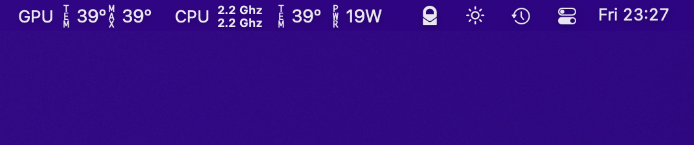

# RadeonSensor - Kext and Gadget to show Radeon GPU temperature on MacOS

The kext is based on FakeSMCs RadeonMonitor to provide GPU temperature to a dedicated gadget without relying on FakeSMC being installed and can therefore be used with VirtualSMC instead. All credits for the code to read the GPU temperature go to SergeySlice.

The design of the status bar is based on the AMD PowerGadget to fit together.

## GPU temperature and MacOS
Starting with the Radeon VII, Apple stopped reporting the temperature directly, requiring kexts to step in and implement that feature. For Vega 10 and older, other tools can already display the GPU temperature without the need for additional kexts.

Cedits
* [FakeSMC3](https://github.com/CloverHackyColor/FakeSMC3_with_plugins)
* [SMCAMDProcessor](https://github.com/trulyspinach/SMCAMDProcessor)
